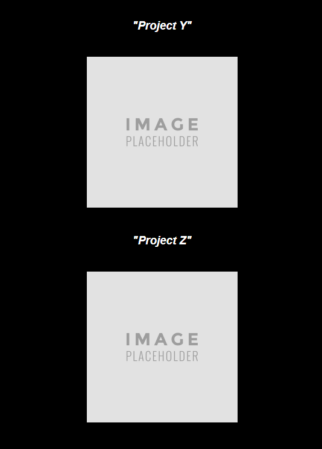
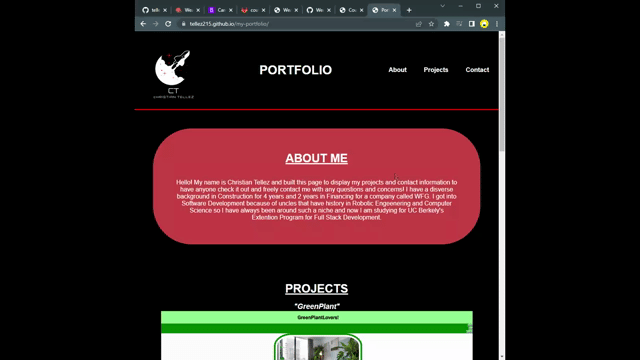

# <em> My First Portfolio <em>
#
https://tellez215.github.io/my-portfolio/

## Description
Hello and welcome to my first ever portfolio! I created this portfolio to display my projects and contact information to network and have potential employers take a look at my past and current projects. In my portfolio, I display 4 projects along with a brief section talking about me! I also added my contact information below for any questions or concerns.

## <em> Roadmap <em>
As this is my first ever portfolio, changes will be made in the next coming months. In my portfolio , there are 2 more sections which are empty , where I will add more projects and collaborations will fellow peers and will add more visually appealing colors and overall a better layout. I am very happy with the first outcome of this but more will soon come! A major change I will make is making the page more resposive with the users by implemeting JavaScipt into my page. I will also be adding a more concrete "Contact Me" portion of my page where users will have a responsive and visually appealing layout with it. More too come!

 

 Above is the current "Contact Me" which is one of the future changes I will make in the coming months.

 

 Above is the current image holders I have for my future projects since I currently only have a few!

 

## <em>License<em>
[MIT](./LICENSE.txt)